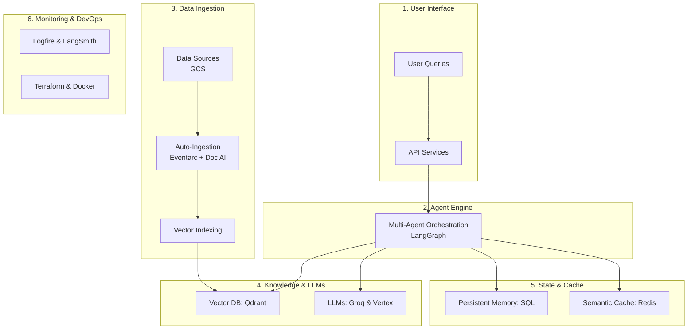
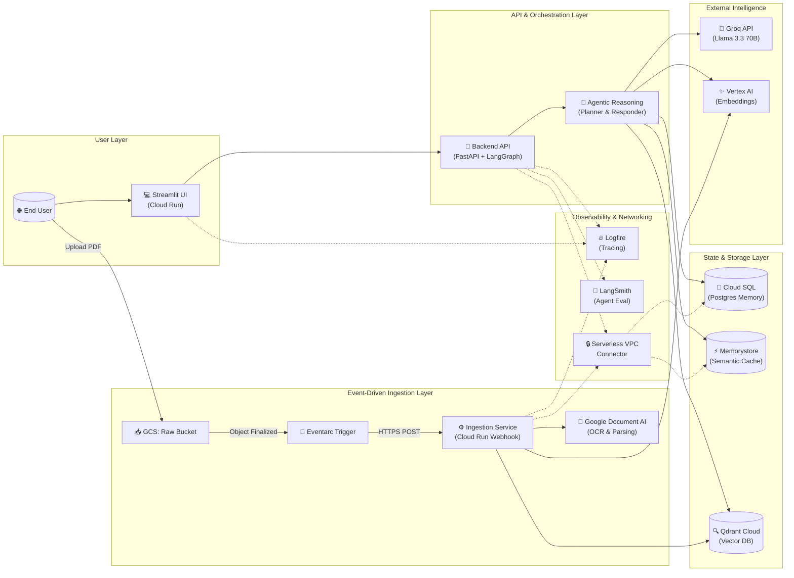

# 🏗️ Scalable Enterprise Agentic RAG Architecture
echo "# Enterprise-RAG-with-GCP" >> README.md
git init
git add README.md
git commit -m "first commit"
git branch -M main
git remote add origin https://github.com/ChanduKudikala-06/Enterprise-RAG-with-GCP.git
git push -u origin main
This document visualizes the complete cloud-native infrastructure of the system. The architecture is designed for **High Availability**, **Sub-100ms Caching**, and **Automated Event-Driven Ingestion**.

## 🌟 Executive Summary (High-Level View)
This simplified view shows the 6 main pillars of our Enterprise RAG system.

## 🏗️ Detailed Technical Architecture (Landscape View)

## 🛠️ Component Breakdown

### 1. Compute (Cloud Run)
*   **Microservices Architecture**: Split into UI, Backend, and Ingestion to allow independent scaling.
*   **Serverless**: Automatically scales to zero when not in use to save costs.

### 2. Event-Driven Automation
*   **GCS + Eventarc**: Eliminates manual ingestion. Uploading a file to the "Raw" bucket immediately wakes up the Ingestion service.
*   **Document AI**: Uses Google's enterprise-grade OCR for high-fidelity PDF parsing.

### 3. Persistent Memory & Speed
*   **Postgres (Cloud SQL)**: Stores conversation history (Checkpoints) so the Agent remembers past interactions across sessions.
*   **Redis (Memorystore)**: Implements **Semantic Caching** using `redisvl` to return answers in ~50ms if a similar question was asked before.

### 4. Networking & Security
*   **VPC Connector**: Provides a secure "Tunnel" between Cloud Run and the private Database/Cache, ensuring no data travels over the public internet.
*   **IAM Roles**: Follows the Principle of Least Privilege (PoLP) for all Service Accounts.

### 5. Observability
*   **Logfire**: Provides distributed tracing across all three microservices.
*   **LangSmith**: Dedicated evaluation and debugging for the LangGraph agentic flow.
